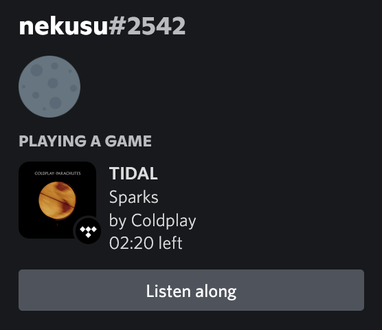

<h1 align="center">TIDAL Enhanced Patcher</h1>

<p align="center">
  
</p>

TIDAL Enhanced Patcher is a simple script that allows you to extend the functionality of the TIDAL desktop app by modifying the [.asar](https://github.com/electron/asar) file.

## Features

### Discord Rich Presence integration



Unlike many other [awesome repositories](https://github.com/search?q=tidal+discord) trying to address the lack of official Discord RPC integration, TEP directly modifies the source code so there is no need to run scripts in the background, reverse engineer the TIDAL API, or use third-party APIs. A native-like experience!

## Usage

**Only Windows platforms are supported.** [Node.js](https://github.com/coreybutler/nvm-windows) required.

```sh
git clone git@github.com:nekusu/tidal-enhanced-patcher.git
cd tidal-enhanced-patcher
node patch
```

The script will automatically find the app path, extract the source code, patch it, and create the asar package. A backup of the original file will be created.

**App updates will most likely require running the patcher again.**

You can undo the changes by running the following command:

```sh
node unpatch
```

Alternatively, you can go to `C:\Users\[user]\AppData\Local\TIDAL\app-[version]\resources`, remove the `app.asar` file, and rename the `app_original.asar` file to `app.asar`.

## TODO

- Discord RPC toggle in system tray menu.
- Auto-patch source code after an app update.
- MacOS support.
- Integration with [Tidal-Media-Downloader](https://github.com/yaronzz/Tidal-Media-Downloader) (?).

## Notes for devs

[Debugtron](https://github.com/bytedance/debugtron) made this project possible, check it out!

`node_modules` are included in the repo due to a modification to the [asar npm package](https://www.npmjs.com/package/asar) `(asar/lib/asar.js:187)`. This change will avoid errors with .symlink files located in `C:\Users\[user]\AppData\Local\TIDAL\app-[version]\resources\[source]\resources\osx`.

To manually extract the source code files run the following command:

```sh
node extract
```
