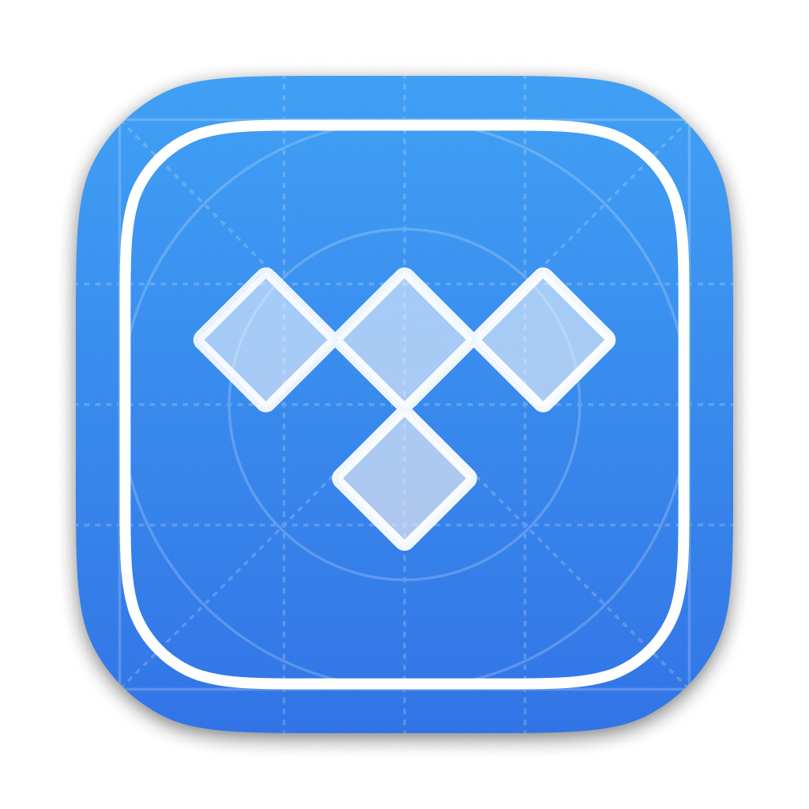
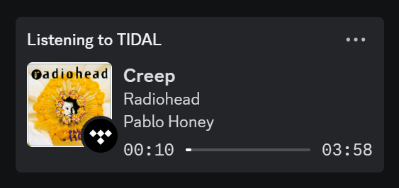
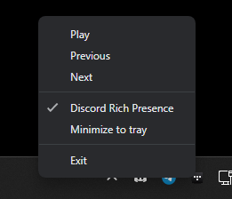
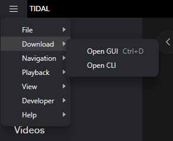
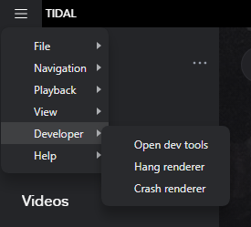

<h1 align="center">TIDAL Enhanced Patcher</h1>

<p align="center">
  
</p>

TIDAL Enhanced Patcher is a simple script that allows you to extend the functionality of the TIDAL desktop app by modifying the [ASAR archive](https://www.electronjs.org/docs/latest/tutorial/asar-archives).

## Features

### Discord Rich Presence integration





Unlike many other [awesome repositories](https://github.com/search?q=tidal+discord) trying to address the lack of official Discord RPC integration, TEP directly modifies the source code so there is no need to run scripts in the background, reverse engineer the TIDAL API, or use third-party APIs. You can also toggle RPC very easily from the system tray menu. A native-like experience!

### Download your favorite music



TIDAL Enhanced allows you to download music and videos in the highest quality directly from TIDAL thanks to the [Media Downloader](https://github.com/yaronzz/Tidal-Media-Downloader) app, just paste the track/album/artist link in the downloader and enjoy your offline music!

### Developer menu enabled



You can now access various development tools disabled by default in the production build.

## Usage

**Only Windows platforms are supported.** [Node.js](https://github.com/coreybutler/nvm-windows) required.

```sh
git clone https://github.com/nekusu/tidal-enhanced-patcher.git
cd tidal-enhanced-patcher
node patch
```

The script will automatically find the app path, extract the source code, patch it, and create the asar package. A backup of the original file will be created.

**App updates will most likely require running the patcher again.**

You can undo the changes by running the following command:

```sh
node unpatch
```

Alternatively, you can go to `C:\Users\[user]\AppData\Local\TIDAL\app-[version]\resources`, remove the `app.asar` file, and rename the `app_original.asar` file to `app.asar`.

## TODO

- ~~Discord RPC toggle in system tray menu.~~ 🗸
- ~~Integration with [Tidal-Media-Downloader](https://github.com/yaronzz/Tidal-Media-Downloader).~~ 🗸
- Auto-patch source code after an app update.
- MacOS support (?).

## Disclaimer

- [TIDAL Media Downloader disclaimer](https://github.com/yaronzz/Tidal-Media-Downloader#-disclaimer).
- This repository does not distribute any original or modified source code of the TIDAL desktop app.
- I am in no way responsible for account bans for using a modified client. Use the patcher at your own risk.

## Notes for devs

[Debugtron](https://github.com/bytedance/debugtron) made this project possible, check it out!

To manually extract the source code files run the following command:

```sh
node extract
```

`node_modules` are included in the repo due to a modification to the [asar npm package](https://www.npmjs.com/package/asar) [(asar/lib/asar.js:187)](https://github.com/nekusu/tidal-enhanced-patcher/blob/main/node_modules/asar/lib/asar.js#L187). This change will avoid errors with .symlink files located in `[source]/resources/osx` when extracting the asar archive. See [electron/asar#50](https://github.com/electron/asar/issues/50).
