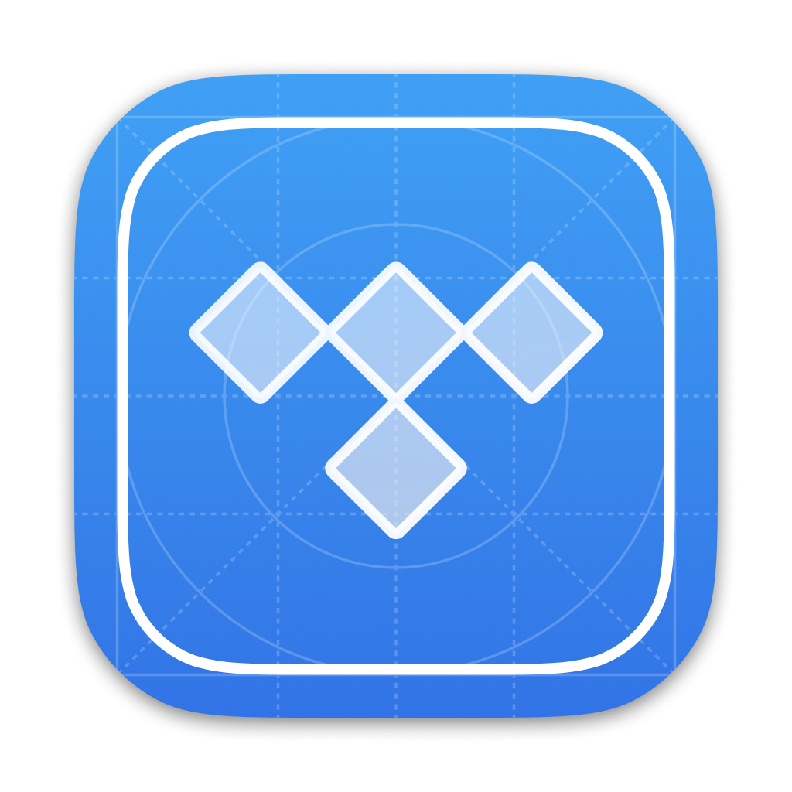
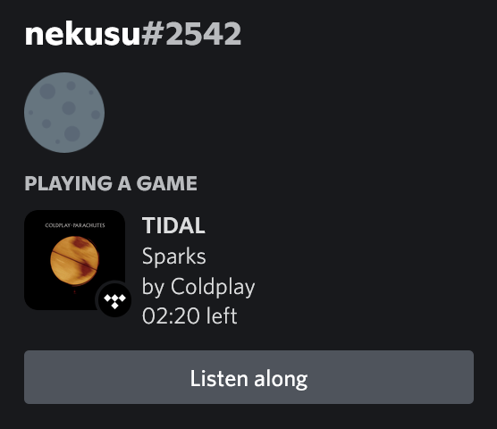
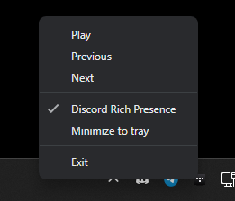
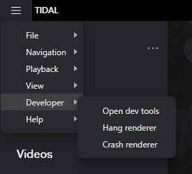

<h1 align="center">TIDAL Enhanced Patcher</h1>

<p align="center">
  
</p>

**TIDAL Enhanced Patcher** is a tool designed to easily extend the functionality of the TIDAL desktop app by modifying its [ASAR archive](https://www.electronjs.org/docs/latest/tutorial/asar-archives).

## Features

### Discord Rich Presence integration



Unlike many other [awesome repositories](https://github.com/search?q=tidal+discord) trying to address the lack of official Discord RPC integration, TEP directly modifies the source code so there is no need to run scripts in the background, reverse engineer the TIDAL API, or use third-party APIs. A native-like experience!

### Download your favorite music

Right-click a track, album, playlist, artist, or video and choose **Download**.

The **Download** menu contains:

- **Download queue…** (`Ctrl+D` / `Cmd+D`): progress, errors, cancel, retry, pause after the current selection, open the output folder, and download by pasted TIDAL link.
- **Download settings…**: output folder, audio quality, video resolution, naming templates, existing-file handling, playlist folders, artist EPs/singles, concurrent downloads, artwork, lyrics, and album information.

Compatible preferences from `~/.tidal-dl.json` are imported once. Native settings are stored in `tep-downloads.json` in TIDAL's user data directory.

Downloads support direct audio. Available quality depends on the account and the stream TIDAL returns. Livestreams and some protected content aren't supported. Downloads do not resume across app restarts; retrying skips existing completed files by default.

**Downloads utilize your existing TIDAL login, no separate authentication needed.**

### Improved system tray menu



Playback controls and a Discord RPC switch can be quickly accessed from the system tray menu.

### Developer menu enabled



You can now access various development tools disabled by default in the production build.

## Usage

**Windows and macOS platforms are supported.**

**Note:** App updates may require running the patcher again.

**MacOS: If a file permission error appears, you need to allow the application to modify applications. Settings -> Privacy & Security -> App Management**

### Using the Precompiled Executable

For users who prefer to download and run the patcher without setting up the development environment.

1. Download the executable:
   - Go to the [Releases](https://github.com/nekusu/tidal-enhanced-patcher/releases) page and download the `TIDALEnhancedPatcher.zip` file.

2. Run the patcher:
   - Extract the downloaded file and double-click the executable to launch the interactive CLI.

### Running from Source Code

For developers or users who want to run it directly from the source.

**Requirements:** You need to have [Bun](https://github.com/oven-sh/bun#install) installed on your system.

#### Installation

1. Clone the repository:
    ```sh
    git clone https://github.com/nekusu/tidal-enhanced-patcher.git
    cd tidal-enhanced-patcher
    ```

2. Install dependencies using Bun:
    ```sh
    bun i
    ```

3. Run the interactive CLI:
    ```sh
    bun main.ts
    ```
    **Alternatively, you can also build and run the executable** by running:
    ```sh
    bun run build
    ```
    ```sh
    # Windows
    .\TIDALEnhancedPatcher.exe
    ```
    ```sh
    # macOS
    ./TIDALEnhancedPatcher
    ```

### CLI Features

The interactive CLI provides three main options: **patching**, **unpatching**, and **extracting source files**.

#### 1. Patching TIDAL

- The patcher will automatically detect whether TIDAL is running and find the executable.
- If the app is already patched, it will first **unpatch** the existing modifications and proceed with patching again.
- A backup of the original asar file is saved, and the app is re-bundled.

#### 2. Unpatching TIDAL

- The patcher will revert all changes made to the app, restoring the original asar file.
- Alternatively, you can go to the app's `resources` folder, remove the `app.asar` file, and rename the `app_original.asar` file to `app.asar`.
  - Windows: `C:\Users\[user]\AppData\Local\TIDAL\app-[version]\resources`
  - macOS: `/Applications/TIDAL.app/Contents/Resources`

#### 3. Extracting Source Files

- The patcher will extract the source files from the asar archive.

## Development checks

Run `bun test` and `bun run typecheck`. Tests use generated audio, simulated TIDAL responses, and DOM fixtures; no account or music downloads are needed. Native menu installation validates its integration points and stops patching if the desktop source layout is incompatible. The remotely served music UI can still change independently of desktop updates.

## Disclaimer

- This repository does not distribute any original or modified source code of the TIDAL desktop app.
- I am in no way responsible for account bans for using a modified client. Use the patcher at your own risk.

## Acknowledgments

[Debugtron](https://github.com/bytedance/debugtron) made this project possible, check it out!
